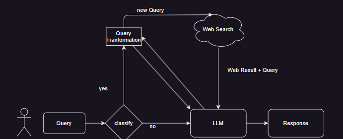

# **Search LLM**

**Search LLM** is a Python-based project designed to enhance the accuracy and relevance of responses by integrating Large Language Models (LLMs) with real-time web search. This project uses various tools and frameworks, including DuckDuckGo for web search, Google Generative AI for text generation, and FastAPI for efficient API handling.




## **Features**

- **Web Search Integration**: Fetches real-time information from the web using DuckDuckGo.
  
  

- **LLM-Based Text Generation**: Generates text responses based on user queries with advanced language models using Gemini (Google Generative AI).
  
  

- **Asynchronous API**: Handles requests efficiently with a FastAPI-based backend.
  
  

- **Comprehensive Logging**: Monitors and debugs using Loguru for detailed logging.
  
  

- **User-Friendly Frontend**: Interact with the system via an intuitive Streamlit web interface.
  


## **Installation**

1. **Clone the Repository**:
    ```bash
    git clone https://github.com/bayesianinstitute/SearchGPT.git
    cd SearchGPT
    ```

2. **Create a Virtual Environment**:
    ```bash
    python -m venv env
    source env/bin/activate  # On Windows: `env\Scripts\activate`
    ```

3. **Install Dependencies**:
    ```bash
    pip install -r requirements.txt
    ```

4. **Install the Package**:
    ```bash
    python setup.py sdist bdist_wheel
    pip install .
    ```

## **Usage**

1. **Run the FastAPI Server**:
    ```bash
    cd backend
    uvicorn app:app --reload
    ```

2. **Access the API**:
    Open your browser and navigate to `http://127.0.0.1:8000` to interact with the API.

3. **Example Request**:
    - **POST /ask/search**: Submit a query to the LLM with optional web search integration.
    
    ```bash
    curl -X POST "http://127.0.0.1:8000/ask/search" -H "Content-Type: application/json" -d '{"query":"Who won Euro 2024 ?"}'
    ```

4. **Run the Application (Optional)**:
    - **Streamlit UI**:
        ```bash
        cd app
        streamlit run UI.py
        ```
    - **Command Line Interface (CLI)**:
        ```bash
        python cli.py
        ```

## **Project Structure**

- `src/`: Source code for the project.
- `app/`: Contains UI and CLI application code.
- `backend/`: Contains the API service code.
- `requirements.txt`: Lists the required Python packages.
- `setup.py`: Script for building and installing the package.

## **References**

- **[duckduckgo-search](https://pypi.org/project/duckduckgo-search/)**: Python package for web search using DuckDuckGo without API keys.
- **[Loguru](https://loguru.readthedocs.io/)**: A user-friendly logging library for Python.
- **[Google Generative AI](https://developers.generativeai.google/)**: Access Google's Generative AI models for advanced text generation.
- **[Streamlit](https://docs.streamlit.io/)**: Framework for creating custom web apps for data science and machine learning.
- **[FastAPI Documentation](https://fastapi.tiangolo.com/)**: Official documentation for FastAPI, including tutorials and guides.

